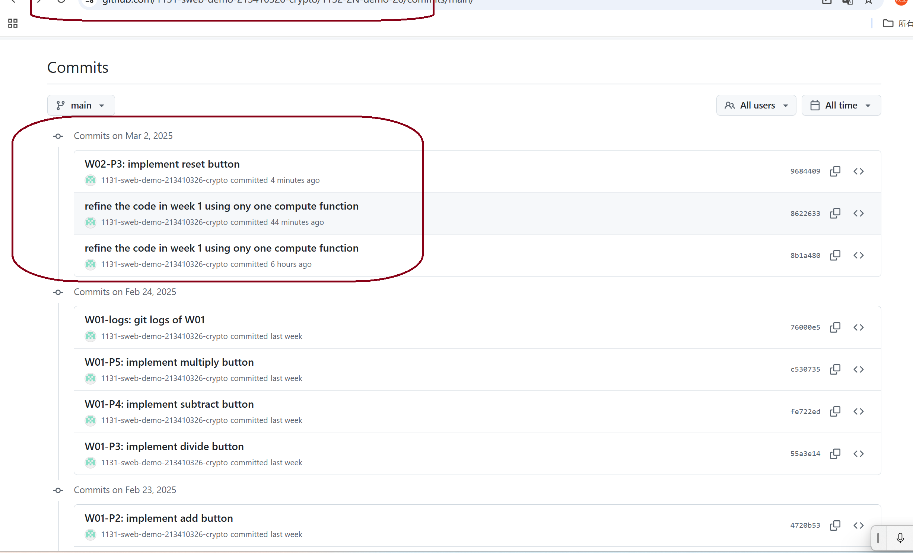

[Github URL](https://github.com/1131-sweb-demo-213410326-crypto/1132-2N-demo-26)

### W02-P1: 


#### => share to teacher and TA


```
871420f 1131-sweb-demo21341032  Sun Feb 23 21:45:53 2025 +0800       W01-P1: Create a Github repo for 1132 semester
```

### W02-P2: implement add button


 
```
4720b53 1131-sweb-demo21341032  Sun Feb 23 23:37:30 2025d +0800       W01-P2: implement add button
```
### W02-P3: implement divide button
 

 
```
55a3e14 1131-sweb-demo21341032  Mon Feb 24 13:45:46 2025 +0800  W01-P3: implement divide button
```
### W02-P4: implement subtract button
 

 
```
fe722ed 1131-sweb-demo21341032  Mon Feb 24 14:02:08 2025 +0800  W01-P4: implement subtract button
```
### W02-P5: implement multiply button
 

 
```
c530735 1131-sweb-demo21341032  Mon Feb 24 14:08:23 2025 +0800  W01-P5: implement multiply button
```

### W02-logs: git logs of W01

 

```
76000e5 1131-sweb-demo21341032  Mon Feb 24 14:16:01 2025 +0800  W01-logs: git logs of W01
```
 