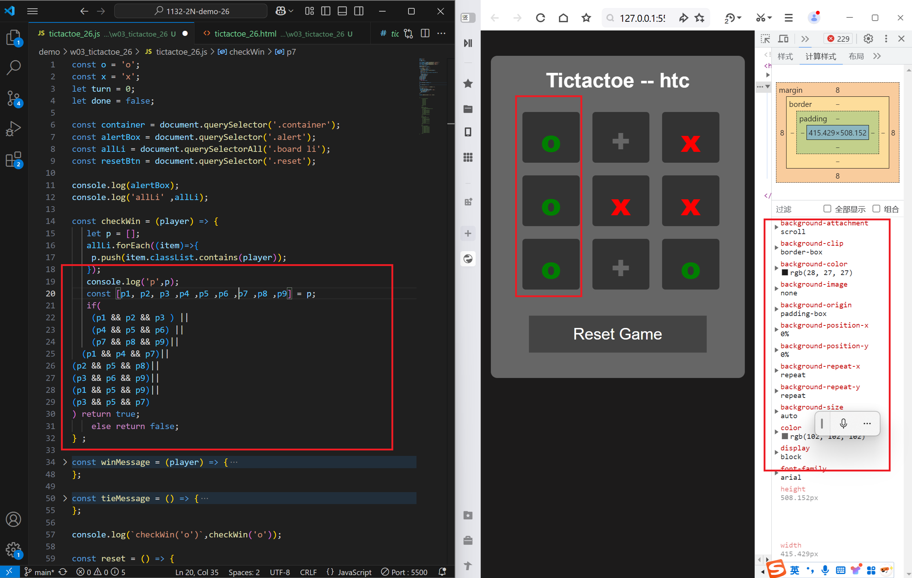
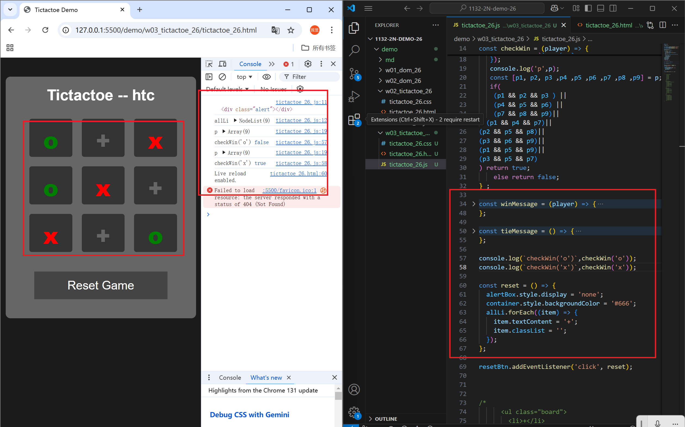
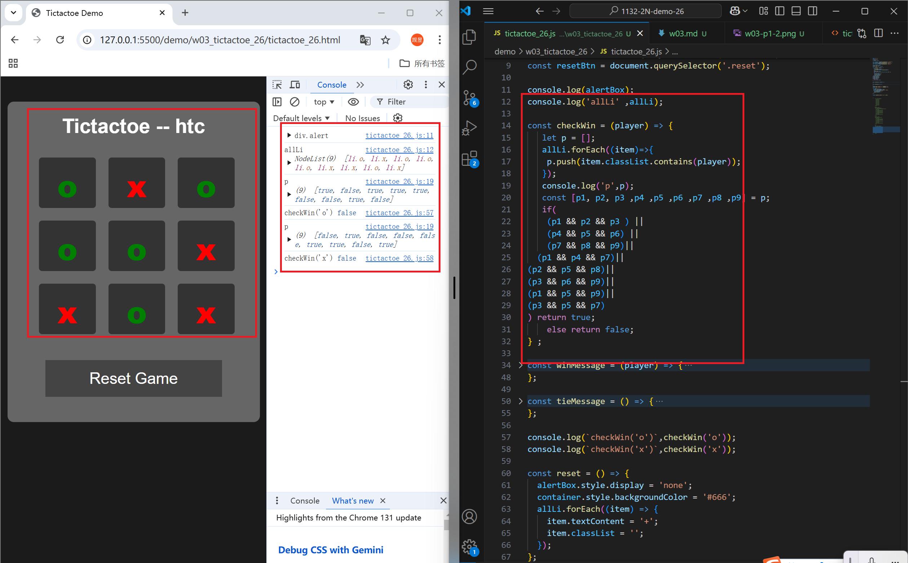
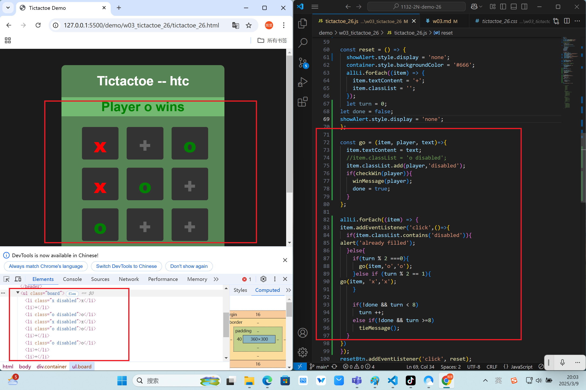
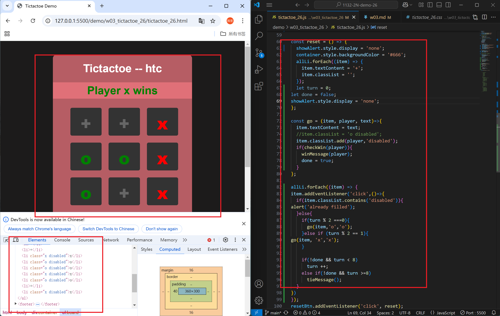
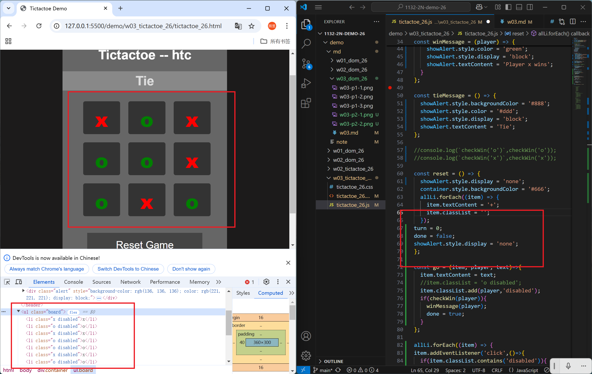

[Github URL](https://github.com/1131-sweb-demo-213410326-crypto/1132-2N-demo-26)

### W03-P1: Implement checkWin(player) using three different cases
 
#### => player o wins
 

 
#### => player x wins
 

 
#### => no player wins
 

```
6dba4ca 1131-sweb-demo21341032  Sun Mar 9 18:07:39 2025 +0800 Implement checkWin(player) using three different cases
```
### W03-P2: play TicTacToe successfully
 
#### => player o wins
 

 
#### => player x wins
 

 
#### => tie
 

 
```
6dba4ca 1131-sweb-demo21341032  Sun Mar 9 18:07:39 2025 +0800        Implement checkWin(player) using three different cases
```