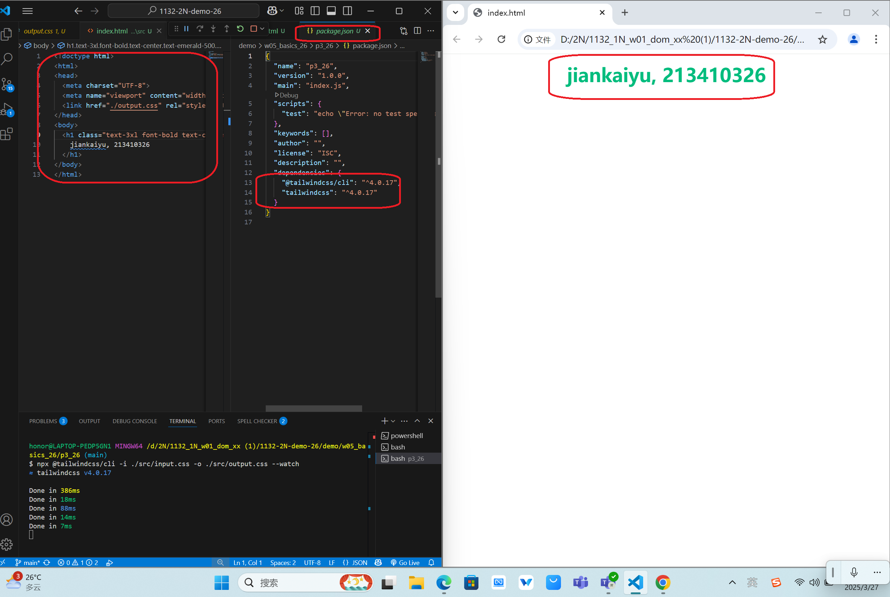
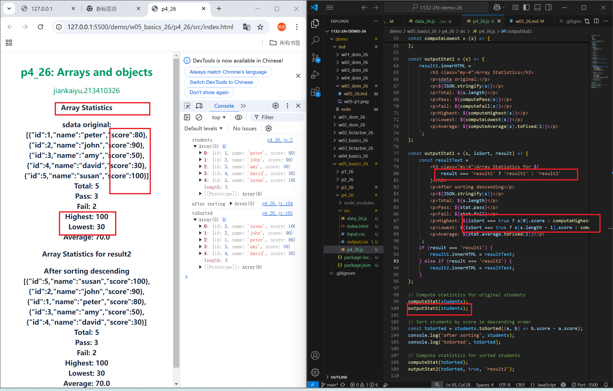
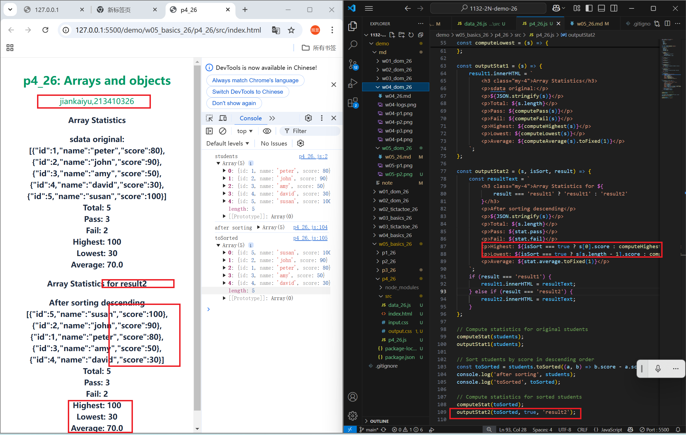

[Github URL](https://github.com/1131-sweb-demo-213410326-crypto/1132-2N-demo-26)

### W05-P1: Use Tailwindcss CLI to show tailwind css without internet access
 

```
6896dd5 1131-sweb-demo21341032  Thu Mar 27 19:10:32 2025 +0800  W05-P1: Use Tailwindcss CLI to show tailwind css without internet access
```
### W05-P2: use students object array to show statistics
 
#### => no sorting, show in result1 section
 

 
#### => after sorting, show in result2 section
 

 
```
f7b8f5e 1131-sweb-demo21341032  Sun Mar 30 21:21:25 2025 +0800  W05-P2: use students object array to show statistics
```