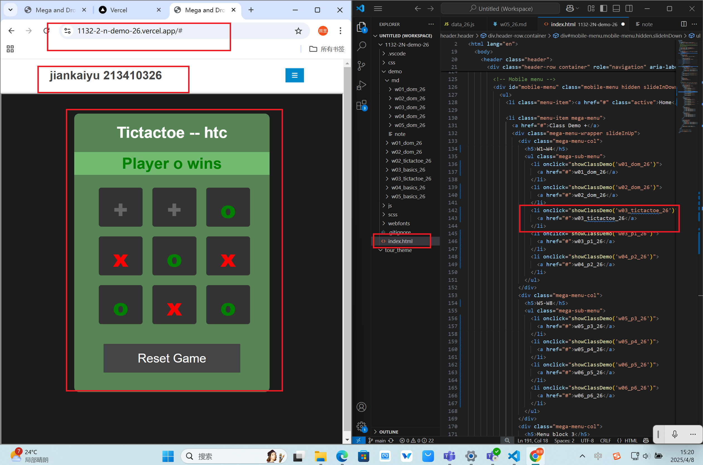
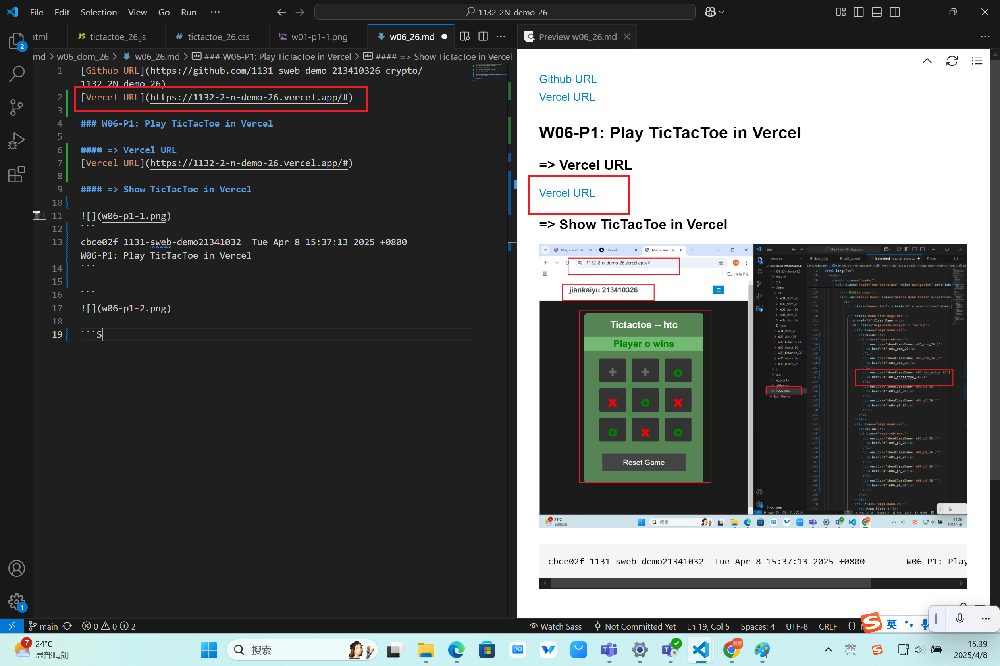
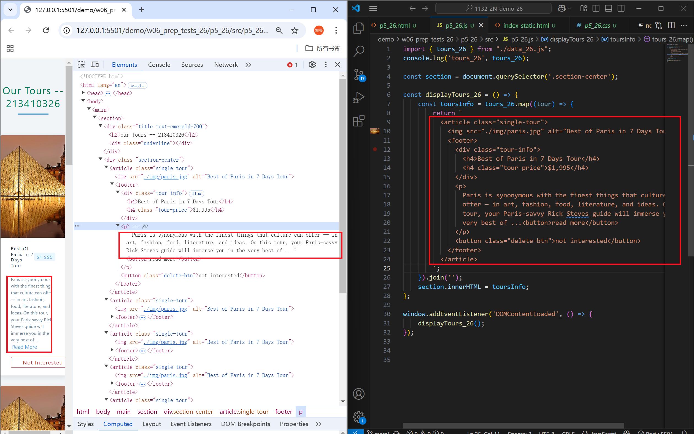
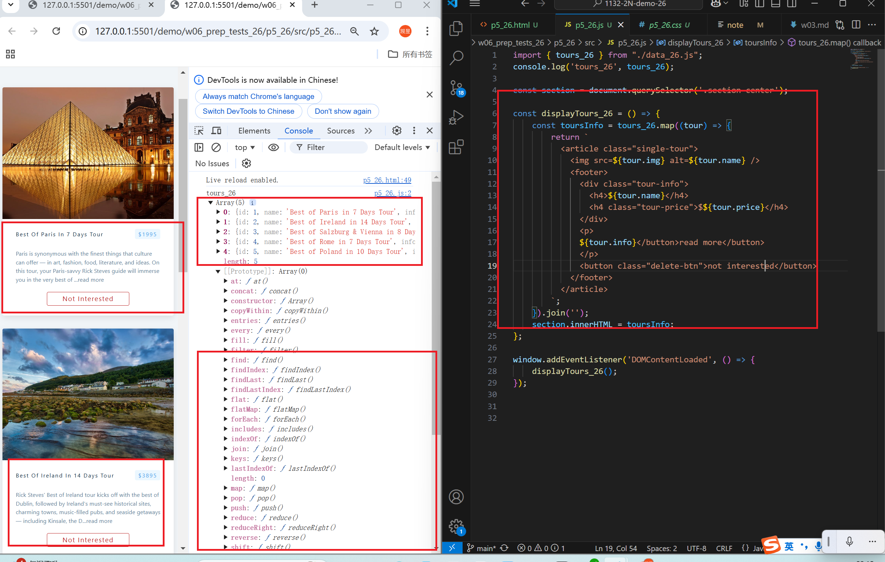
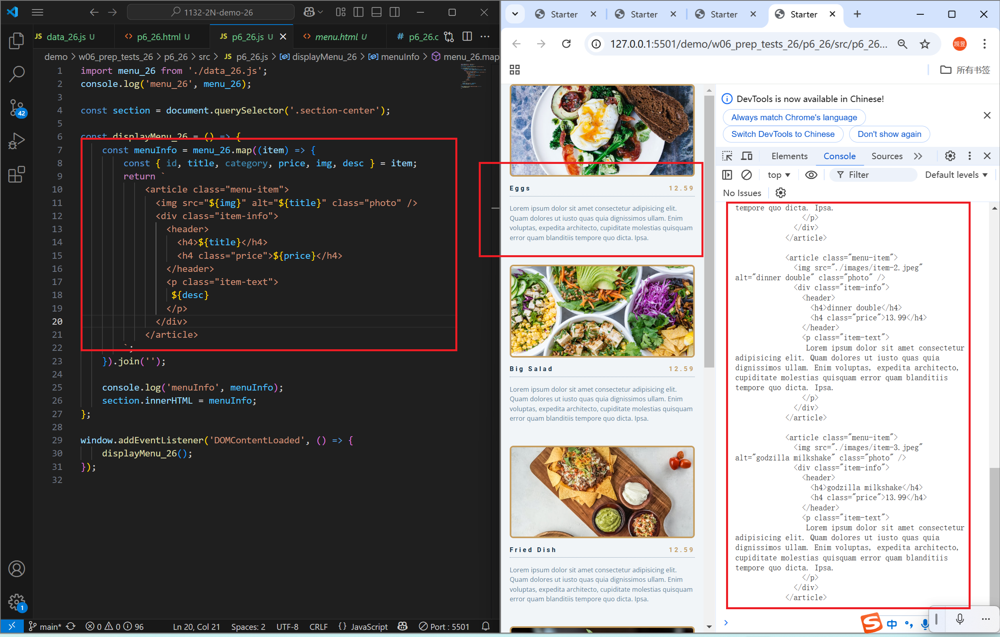
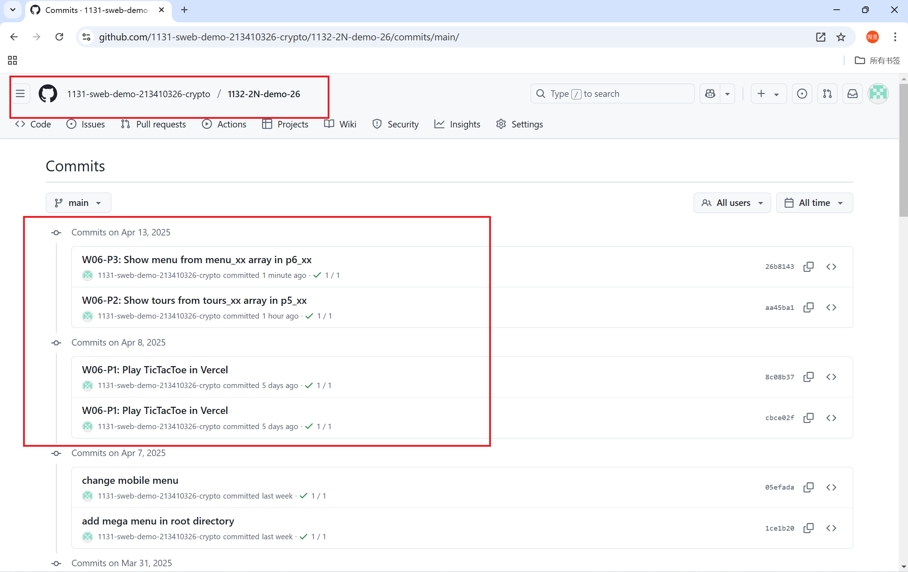

[Github URL](https://github.com/1131-sweb-demo-213410326-crypto/1132-2N-demo-26)
[Vercel URL](https://1132-2-n-demo-26.vercel.app/#)
### W06-P1: Play TicTacToe in Vercel
 
#### => Show TicTacToe in Vercel
 

 
#### => Vercel URL
 
[Vercel URL](https://1132-2-n-demo-26.vercel.app/#)
 

 
```
8c08b37 1131-sweb-demo21341032  Tue Apr 8 15:47:01 2025 +0800   W06-P1: Play TicTacToe in Vercel
```
### W06-P2: Show tours from tours_xx array in p5_xx
 
#### => all tours are the same
 

 
#### => each tour is different based on the info in tours_xx array
 

 
```
aa45ba1 1131-sweb-demo21341032  Sun Apr 13 22:21:06 2025 +0800  W06-P2: Show tours from tours_xx array in p5_xx
```
### W06-P3: Show menu from menu_xx array in p6_xx
 

 
```
26b8143 1131-sweb-demo21341032  Sun Apr 13 23:49:33 2025 +0800  W06-P3: Show menu from menu_xx array in p6_xx
```
### W06-logs: git logs of W06
 

```
2039089 1131-sweb-demo21341032  Sun Apr 13 23:54:02 2025 +0800  W06-logs: git logs of W06
```