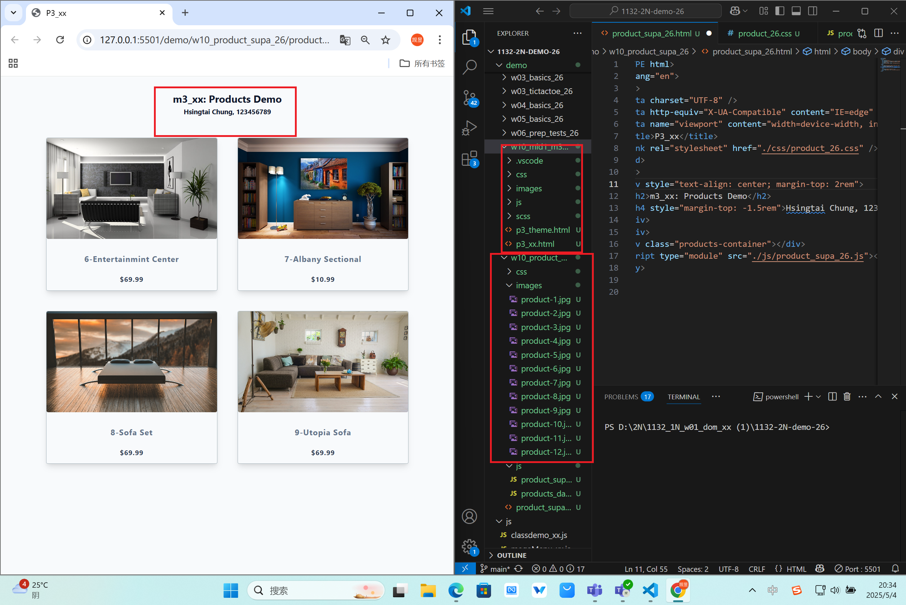
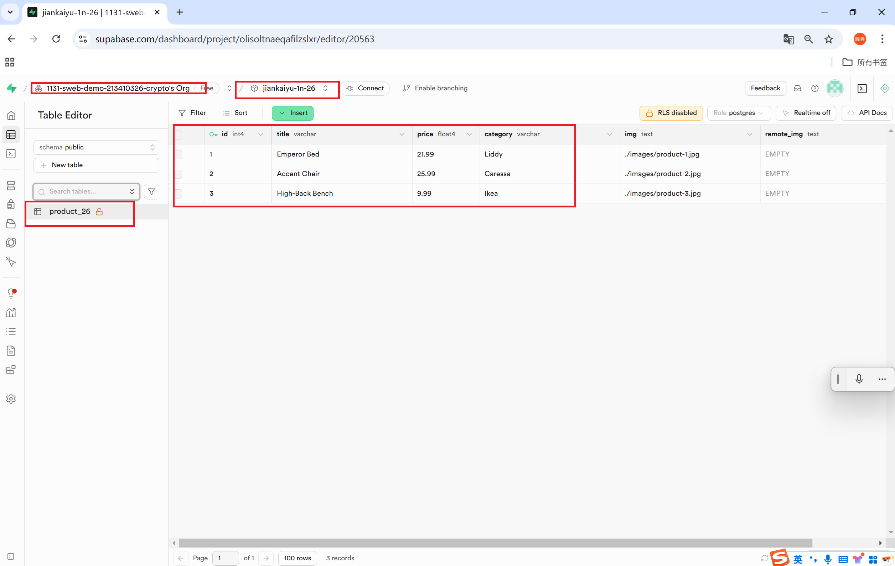
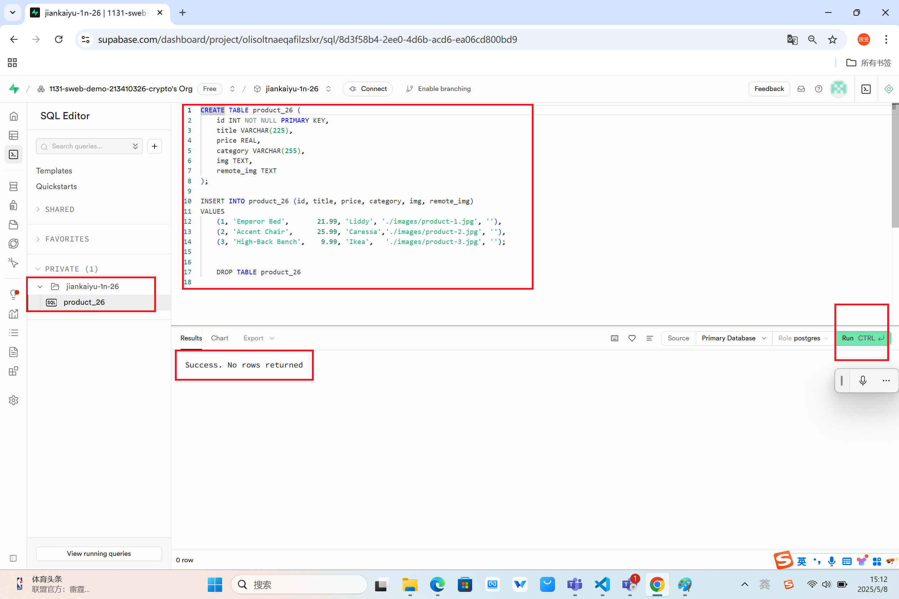
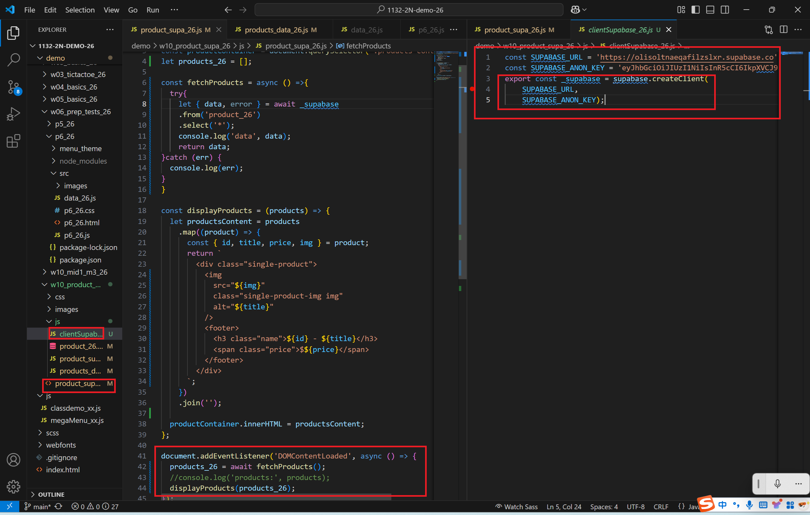
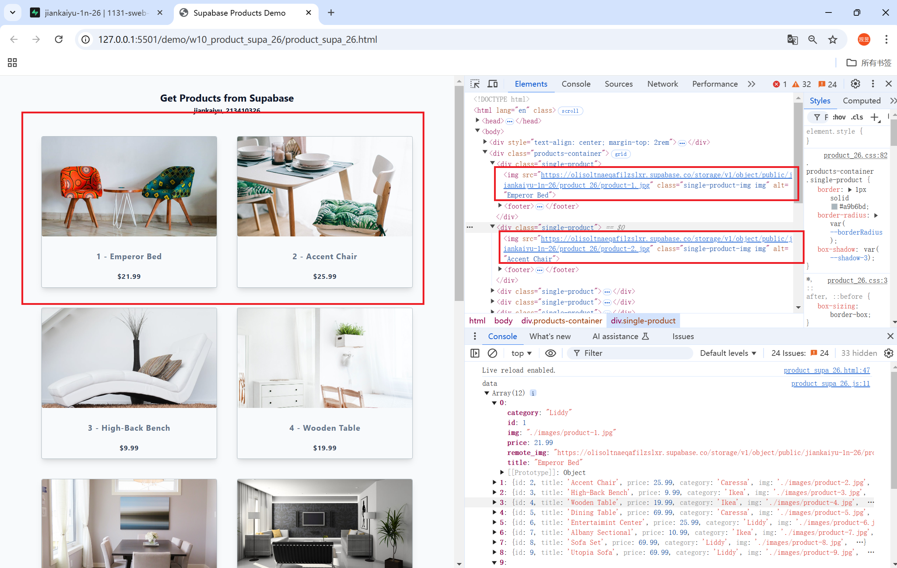
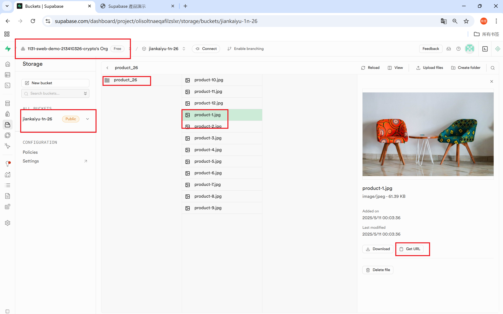
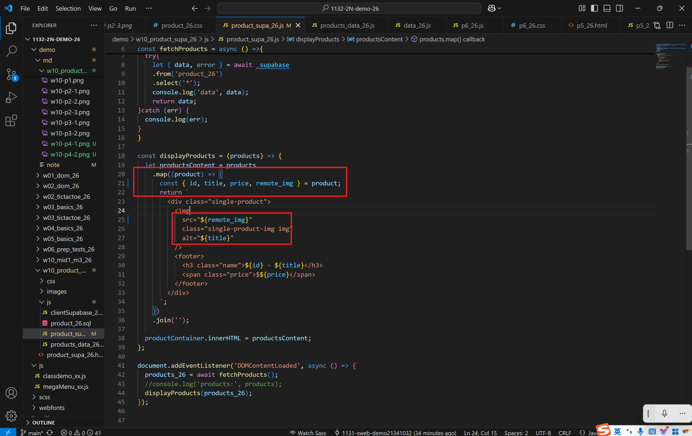
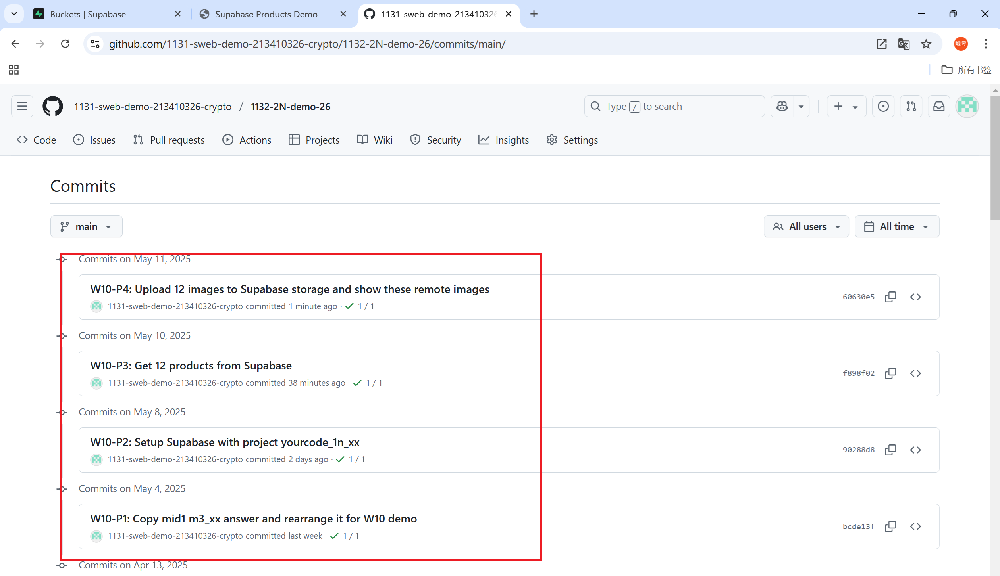

[Github URL](https://github.com/1131-sweb-demo-213410326-crypto/1132-2N-demo-26)
[Vercel URL](https://1132-2-n-demo-26.vercel.app/#)
### W10-P1: Copy mid1 m3_xx answer and rearrange it for W10 demo
 

 
```
bcde13f 1131-sweb-demo21341032  Sun May 4 21:19:37 2025 +0800  
```
### W10-P2: Setup Supabase with project yourcode_1n_xx
 
#### => show product_xx table with 3 data
 

 
#### => show SQL to create product_xx table and insert three data
 

 
#### => show Project URL and ANON KEY for this project
 

 
```
90288d8 1131-sweb-demo21341032  Thu May 8 15:34:38 2025 +0800 
```
### W10-P3: Get 12 products from Supabase
 
#### => show how to fetch products from Supabase
 

 
#### => Show how to get supabase-js to create supabase client
 

 
```
f898f02 1131-sweb-demo21341032  Sat May 10 23:47:09 2025 +0800
```
### W10-P4: Upload 12 images to Supabase storage and show these remote images
 
#### => show the first two images are from Supabase storage
 

 
#### => show remote_img in product_xx table
 

 
#### => show the js code to use remote_img instead of img
 

 ```
 60630e5 1131-sweb-demo21341032  Sun May 11 00:24:24 2025 +0800  W10-P4: Upload 12 images to Supabase storage and show these remote images
 ```
 ### W10-logs: git logs of W10
 

```
e768a16 1131-sweb-demo21341032  Sun May 11 00:28:46 2025 +0800  W10-logs: git logs of W10
```