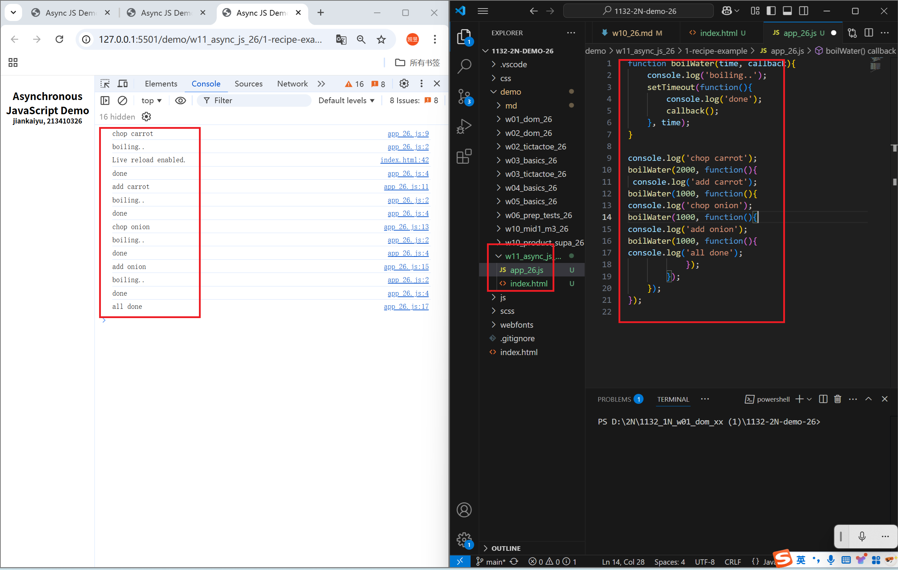
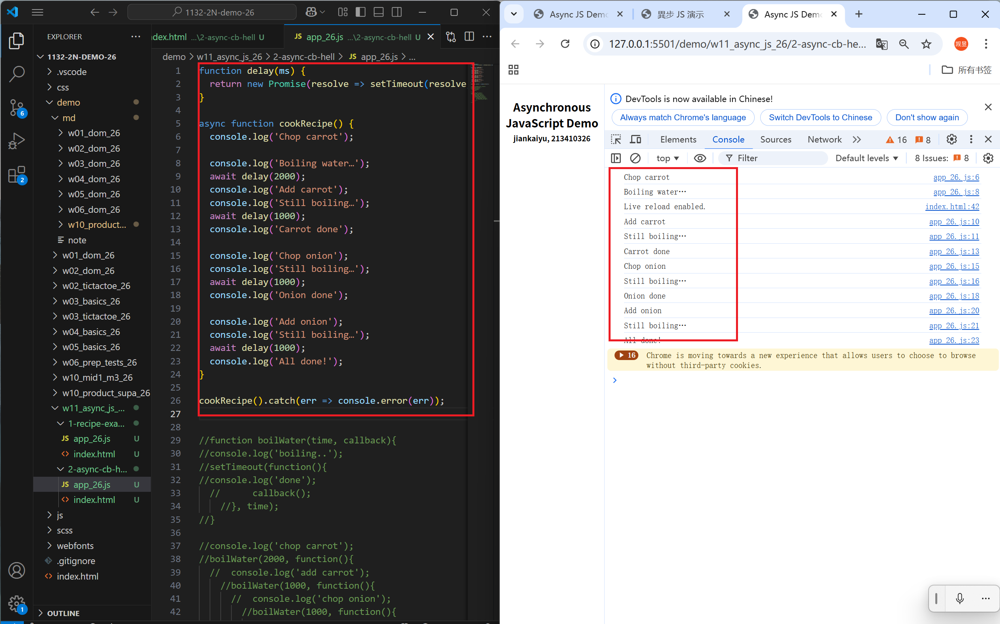
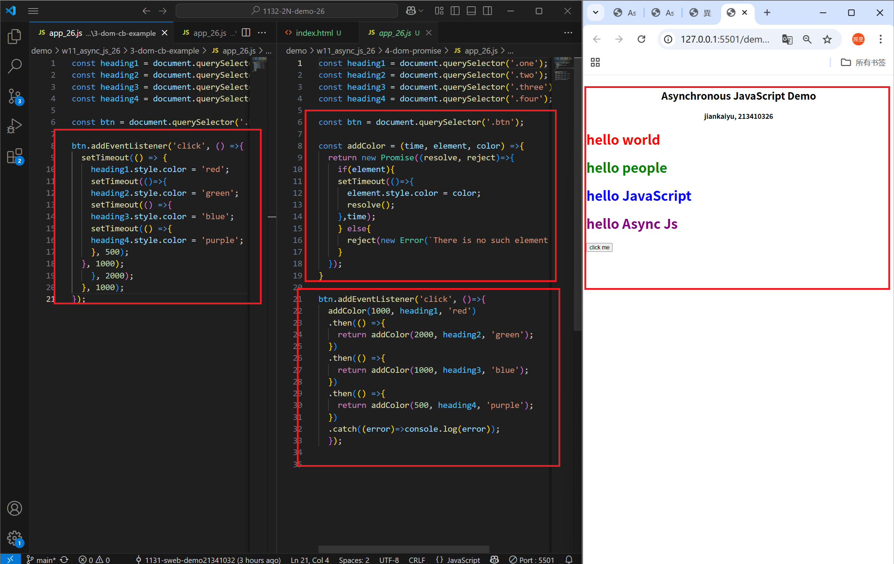
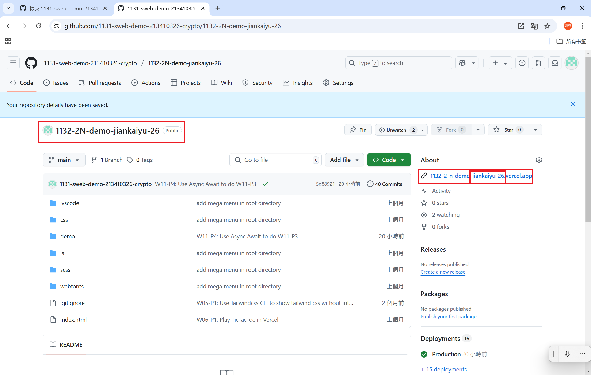
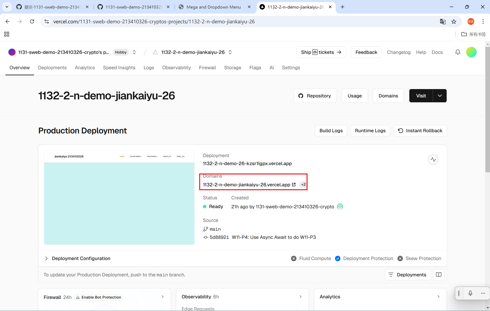
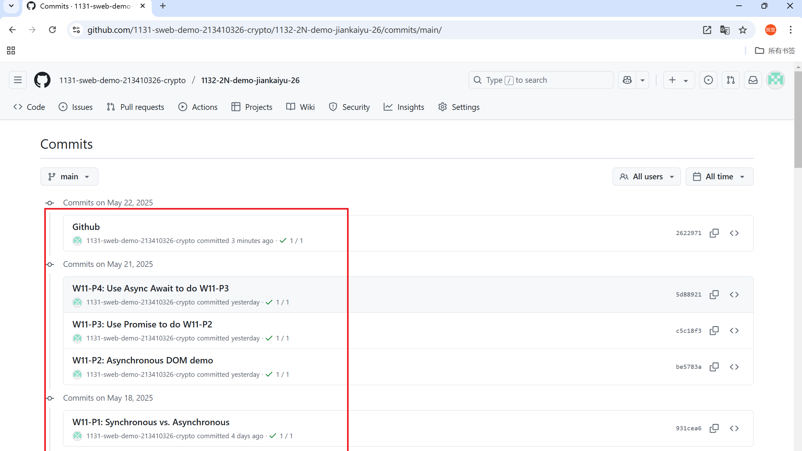

[Github URL](https://github.com/1131-sweb-demo-213410326-crypto/1132-2N-demo-26)
[Vercel URL](https://1132-2-n-demo-26.vercel.app/#)
### W11-P1: Synchronous vs. Asynchronous
 
#### => Synchronous demo
 

 
#### => Asynchronous demo
 

 
```
931cea6 1131-sweb-demo21341032  Sun May 18 23:40:54 2025 +0800 
```
### W11-P2: Asynchronous DOM demo
 

 
```
be5783a 1131-sweb-demo21341032  Wed May 21 18:56:20 2025 +0800 
```
### W11-P3: Use Promise to do W11-P2
 

 
```
c5c18f3 1131-sweb-demo21341032  Wed May 21 22:45:52 2025 +0800
```
### W11-P4: Use Async Await to do W11-P3
 

 
```
5d88921 1131-sweb-demo21341032  Wed May 21 23:13:53 2025 +0800  W11-P4: Use Async Await to do W11-P3
```
W11-P5: Change Github repo name, and Vercel URL
 
#### => Github
 

 
#### => Vercel
 

 
```
2622971 1131-sweb-demo21341032  Thu May 22 20:18:39 2025 +0800  
```
### W11-logs: git logs of W11
 

 
 ```
d511d2e 1131-sweb-demo21341032  Thu May 22 20:25:26 2025 +0800 
```