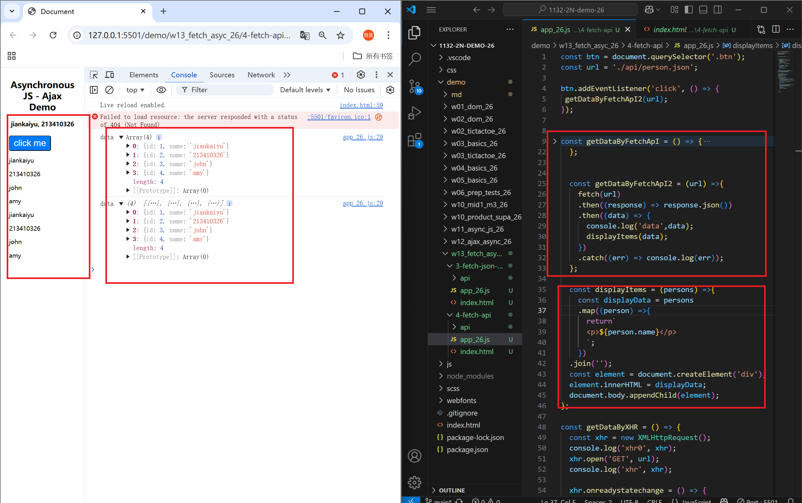
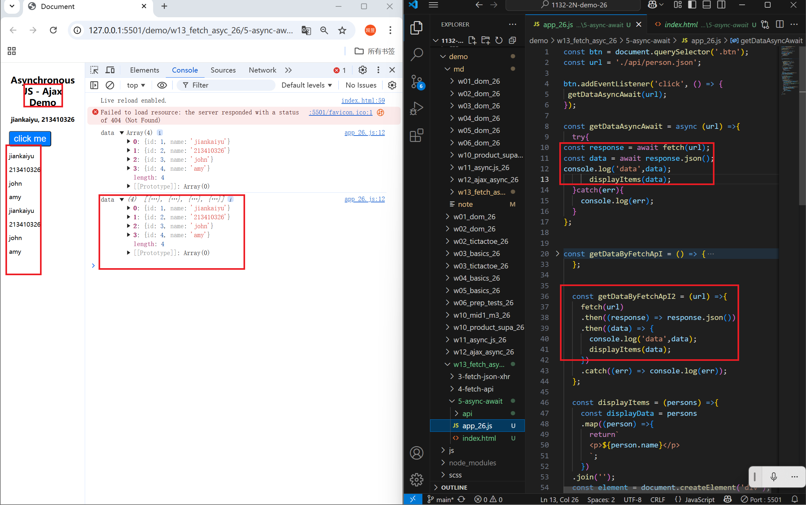
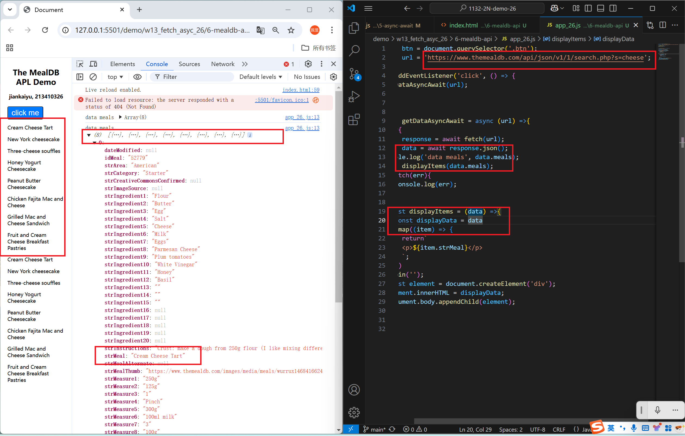
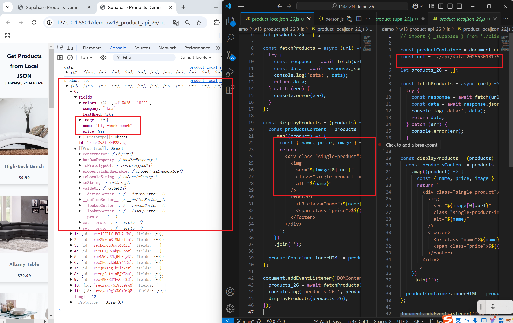
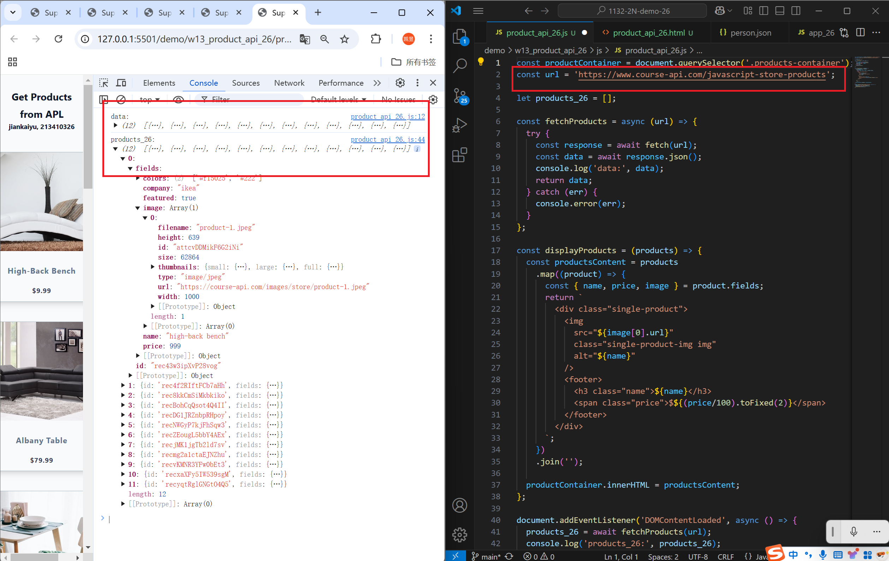
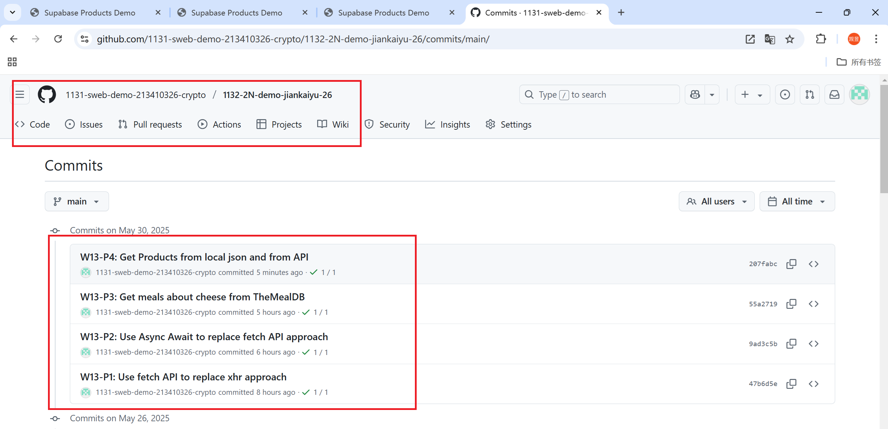

[Github URL](https://github.com/1131-sweb-demo-213410326-crypto/1132-2N-demo-26)
[Vercel URL](https://1132-2-n-demo-26.vercel.app/#)
### W13-P1: Use fetch API to replace xhr approach
 

 
```
47b6d5e 1131-sweb-demo21341032  Fri May 30 13:32:41 2025 +0800   
```
### W13-P2: Use Async Await to replace fetch API approach
 

 
```
9ad3c5b 1131-sweb-demo21341032  Fri May 30 16:22:29 2025 +0800
```
### W13-P3: Get meals about cheese from TheMealDB
 

 
```
55a2719 1131-sweb-demo21341032  Fri May 30 17:09:55 2025 +0800
```
### W13-P4: Get Products from local json and from API
 
#### => Get products from local json
 

 
#### => Get products from API
 

 
```
207fabc 1131-sweb-demo21341032  Fri May 30 22:19:51 2025 +0800 
```
### W13-logs: git logs of W13

 
 ```
 8c02afd 1131-sweb-demo21341032  Fri May 30 22:26:37 2025 +0800 
 ```