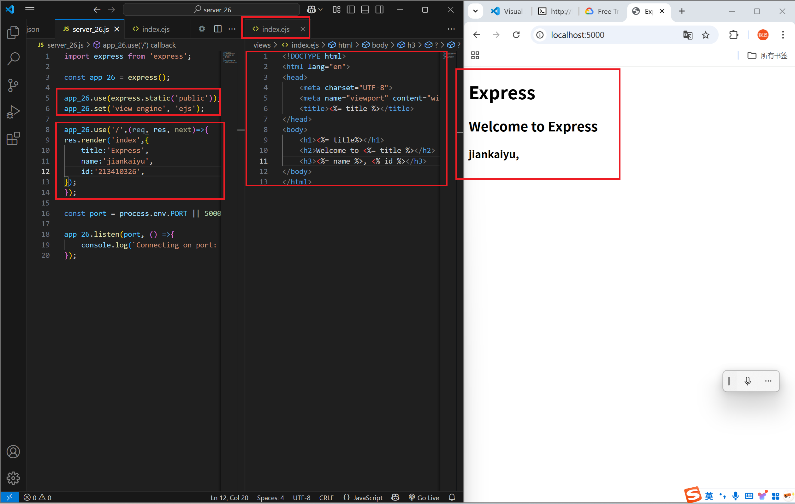
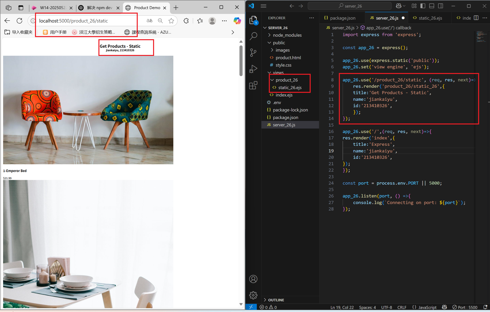
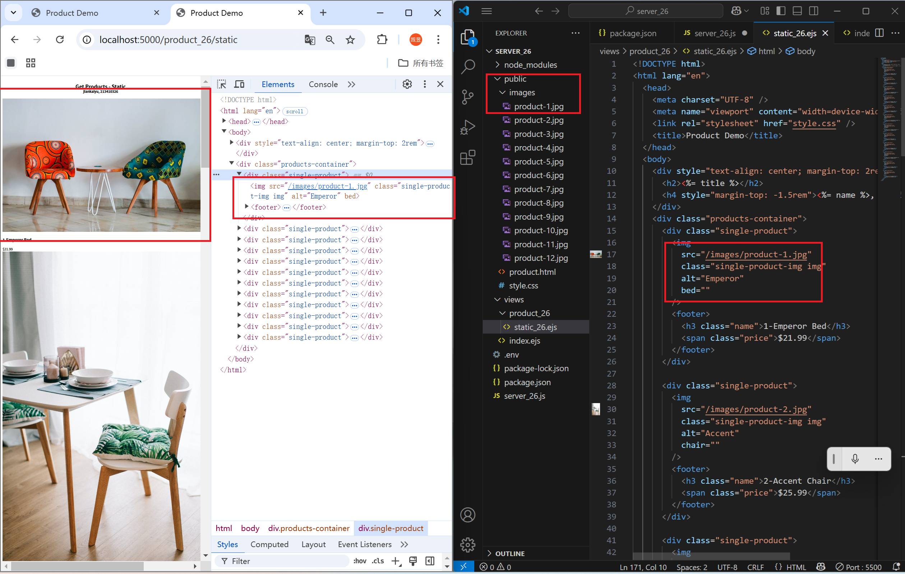
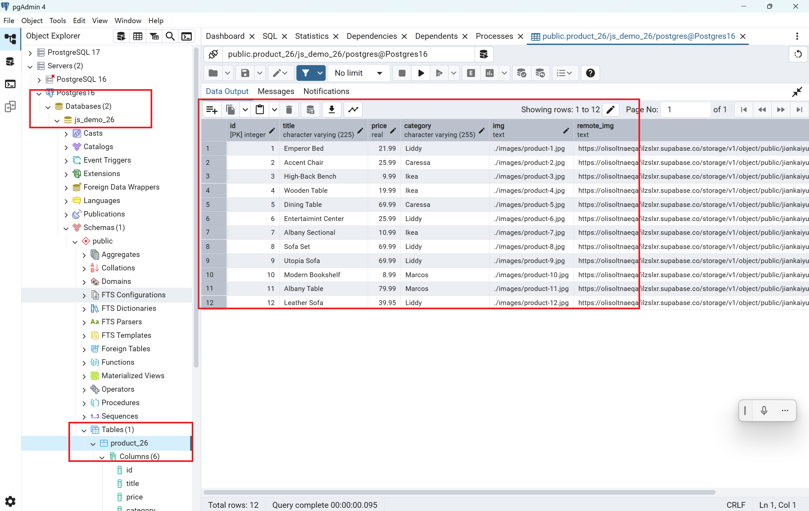
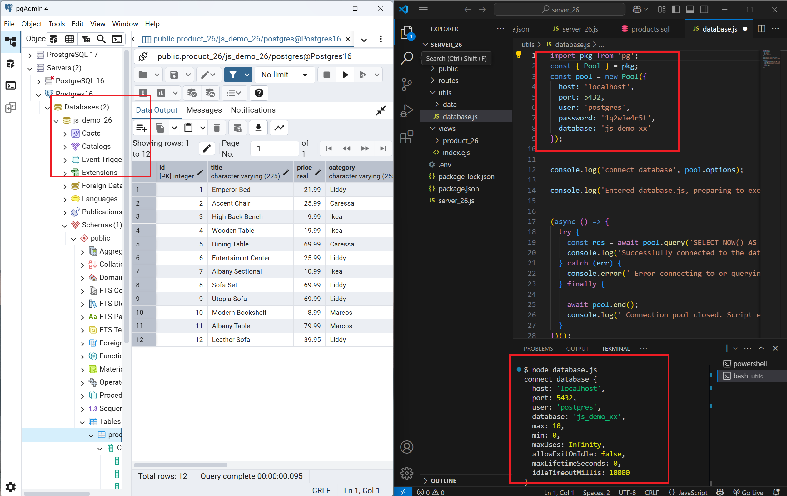
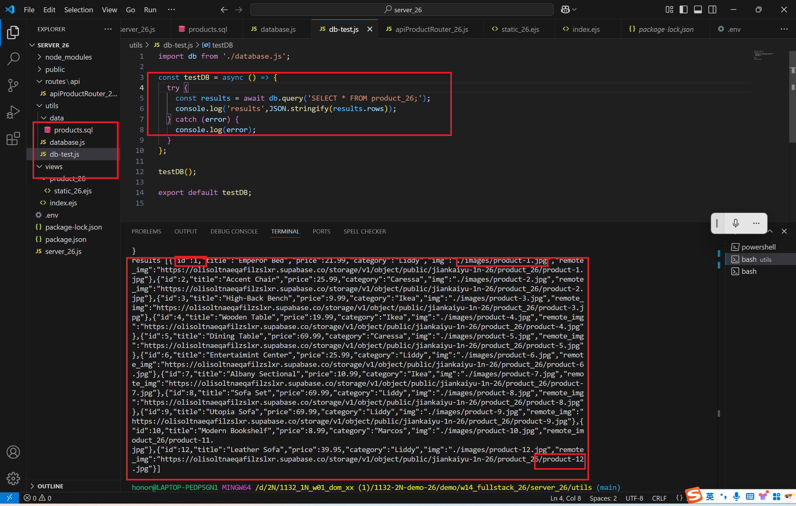
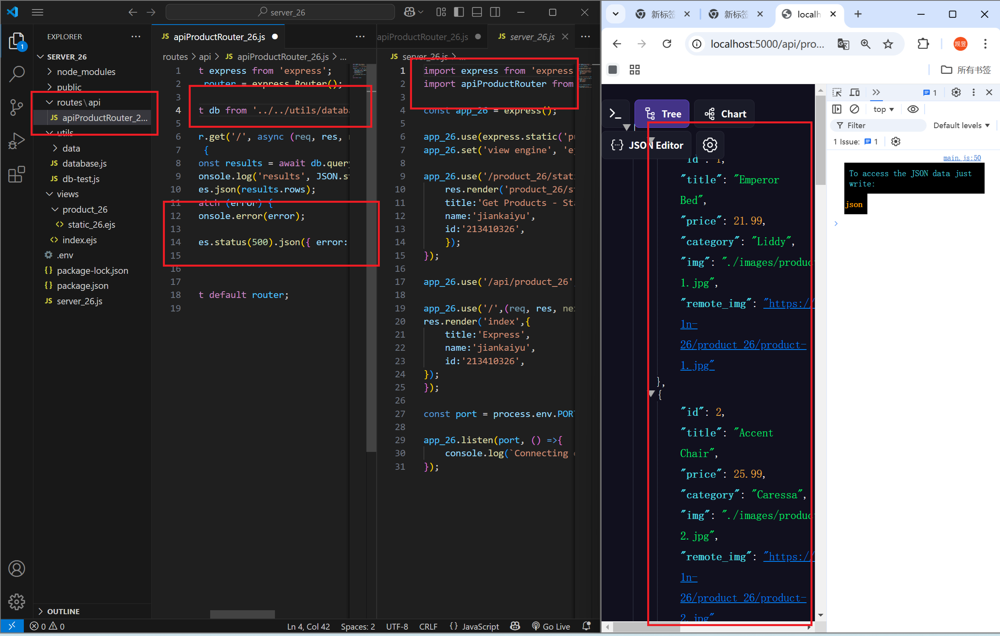

[Github URL](https://github.com/1131-sweb-demo-213410326-crypto/1132-2N-demo-26)
[Vercel URL](https://1132-2-n-demo-26.vercel.app/#)
### W14-P1: show first welcome page
 

 
```
4e1cae2 1131-sweb-demo21341032  Sat May 31 17:20:42 2025 +0800 
```
### W14-P2: Show static products page
 
#### => show render page with data passed into ejs page
 

 
#### => show how the product-1.jpg can be accessed fro public directory as root directory
 

 
```
a2a45e6 1131-sweb-demo21341032  Sat May 31 21:46:43 2025 +0800  W14-P2: Show static products page
```
### W14-P3: Create database js_demo_xx, table product_xx, and insert 12 data, write test code to get all products
 
#### => Create database js_demo_xx, table product_xx, and insert 12 data
 

 
#### => connect js_demo_xx database
 

 
#### => get all product data
 

 
```
a2a45e6 1131-sweb-demo21341032  Sat May 31 21:46:43 2025 +0800 
```
### W14-P4: implement route /api/product_xx to return json data
 

 ```
56d1a6b 1131-sweb-demo21341032  Sun Jun 1 04:39:29 2025 +0800
 ```
